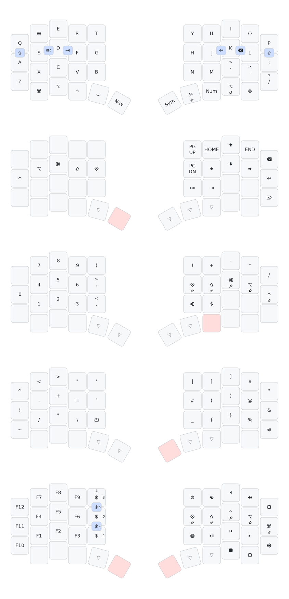

# tku137's ZMK Config


## Keymaps

### Anywhy Flake S



## Local development setup

Refer to the [ZMK docs](https://zmk.dev/docs/development/local-toolchain/setup/native) on how to set up a local dev environment for ZMK. This config contains a `.mise.toml` file that sets up everything for you and provides handy mise tasks to trigger build commands, but does not take care of host dependencies for zephyr. Refer to the [Zephyr docs](https://docs.zephyrproject.org/3.5.0/develop/getting_started/index.html#install-dependencies) for host dependencies.

Mise takes care of all the rest and provides tasks to build, update, clean, ...

To get started, for example run (taken from the docs mentioned above):

```bash
sudo apt install --no-install-recommends git cmake ninja-build gperf \
  ccache dfu-util device-tree-compiler wget \
  python3-dev python3-pip python3-setuptools python3-tk python3-wheel xz-utils file \
  make gcc gcc-multilib g++-multilib libsdl2-dev libmagic1
```

Of course you need [mise](https://mise.jdx.dev/getting-started.html#installing-mise-cli) installed. Also, make sure to have `pipx` so keymap-drawer can be installed.

Then let mise set up your local dev environment (don't forget to `mise trust` first):

```bash
mise run setup-all
```

After that, have a look at `mise tasks ls`.

The most important command is to trigger a full firmware build and collect artifacts in `artifacts/`, run

```bash
mise run release
```

In case needed, clean the build with `mise run clean`. Update all Zephyr/ZMK dependencies using `mise run update`.

## Licensing

This repository and any firmware binaries it produces are released under the **GNU GPL v3.0**.  
The combined work includes:

- **ZMK Firmware** (core framework), which is licensed under the **MIT License** (a GPL-compatible, permissive license).
- **flake-zmk-module** (Anywhy Flake shield definitions), which is licensed under the **GNU GPL v3.0**.

Because the flake-zmk-module is GPL-3.0, the final distributed firmware—containing both MIT-licensed and GPL-licensed components—must itself be licensed under **GPL v3.0**, with the full source code and GPL text made available.
